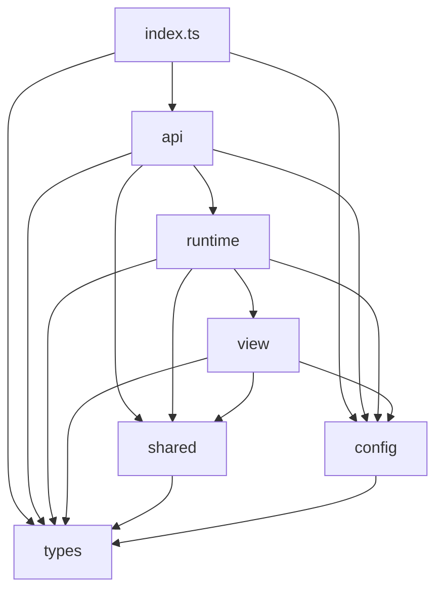

# vue-layerx 设计文档

## 背景

业务弹窗通常是 **layer（容器）+ content（业务内容）** 的组合：

```
UserDialog = MyDialog + UserForm
```

痛点：

1. **content 与 layer 绑死** — UserForm 与某一种 Dialog 写在一起，换 Drawer 要复制或再拆。
2. **样板代码多** — 导入 Dialog、写 template、维护 `modelValue`，而业务上往往只想「把表单放进弹层展示」。

---

## 设计目标

| 角色 | 目标 |
|------|------|
| **content（UserForm）** | 可复用于页内与弹层；只依赖 `vue-layerx`，不依赖 `useDialog`；完成路径为 `emit`，不调 `close`（见 [ADR 0005](docs/adr/0005-content-self-contained-close-on.md)） |
| **layer（MyDialog）** | 通过 `createLayer` 适配，项目内类型有限 |
| **定义侧** | co-locate 默认 layer 配置与操作区模板 |
| **使用侧** | 不写 layer template、不声明 `model`，`open()` / `close()` 即可 |
| **框架** | 命名模板注册 + 配置 merge + 容器适配 |

### 命名约定

| 范围 | 约定 |
|------|------|
| **npm 包 / 项目名** | `vue-layerx`（保留 `x`，不变） |
| **import 路径** | `'vue-layerx'` |
| **公共 API / 类型** | 统一用 `Layer`，**不带 `x`**：`createLayer`、`defineLayer`、`LayerTemplate`、`LayerInstance` 等 |
| **兼容性** | 不考虑旧 `*Layerx*` API 名称；实现与文档以本节为准 |

---

## 核心管线

每次 `open()`：**重建 content 子树**（setup 再跑，`defineLayer` / `LayerTemplate` 在当次上下文中重新注册），再执行：

```text
① peel+normalize  flat Raw（toFragment*）→ LayerConfigFragment（Canonical）
② merge           open > use > define > create  →  LayerConfigFragment
③ adapt           该实例工厂的 createLayer adapter（可选）(fragment) → fragment
④ refs            mergeFragment(store.refs, adapted)  // 框架 internal ref，refs 为第一源
⑤ bind            bindLayer(fragment, visible, close)  →  LayerBound
⑥ render          createLayerViewVNode(bound)  →  h(...)
```

类型域与命名见 [`docs/config-naming.md`](docs/config-naming.md)。

- **peel+normalize**：公开 flat（`LayerConfigContent` / `Container`）拆成双侧分栏，并做糖展开（`props.ref` Ref→callback、`markRaw(component)`）；写入 store 的已是 Canonical。
- **merge**：各层贡献 **Canonical LayerConfigNode 片段**（`content` / `container`）；`closeOn` 在 content、`model` 在 container；**slot 内容**含命令式 `slots` 与 **LayerTemplate 物化后的 slots**，按固定 tier 合并（见「配置 merge」）。
- **adapt**：在 **LayerConfigFragment** 上整形；`open` 已反映在入参中。实例由哪个工厂创建，就跑该工厂 `createLayer` 注册时的**那一个** `adapter`。可换 `container.component`、滤 props、搬 slot key、改 `model`。
- **refs**：`store.refs` 桶在 adapter 之后合并；`props.ref` 链式 compose，internal 先于各 tier 用户 ref。
- **bind**：把 runtime 投影进 props：`closeOn` → content `onXxx`；`visible` → container `[model]` + `onUpdate:${model}`；产出 `LayerBound`。
- **render**：纯 `h()` 绑定 props / slots；**close 后再 open** 时 remount content；已打开时再次 `open()` 只更新 merge/props。

使用者配置 **片段** 在 merge 汇入；**adapt 所见即配置域 fragment**；**bind 产出 LayerBound**（可直接 `h()`）。

`open` 可覆盖 merge 输入（含 `component`、`container.component`），但**不跳过 adapter**——仍走 merge → adapter → refs → bind → render；adapter 可改回或替换 `container.component`。

---

## 源码模块结构

`src/` 按数据流分为五层，对外入口仍为根目录 [`index.ts`](src/index.ts)（re-export `api/` + `types/`）。

### 目录布局

```text
src/
├── index.ts                 # 包入口 barrel
├── api/                     # createLayer / defineLayer / LayerTemplate
├── types/                   # 纯类型契约（config-raw / config / bound / instance / store / layer-host）
├── shared/                  # 跨层运行时契约（Symbol、inject key、检测函数）
├── config/                  # fragment 构造、merge、bind
├── runtime/                 # store、instance 生命周期、portal 挂载
└── view/                    # LayerView 组件、纯 h() 渲染

tests/
└── integration/             # createLayer 端到端测试（与 src/ 分离）
```

| 层 | 职责 | 主要文件 |
|----|------|----------|
| **types/** | 配置 Raw / Canonical / Bound；实例 / Store；LayerHost | `config-raw.ts`、`config.ts`、`bound.ts`、`instance.ts`、`store.ts`、`layer-host.ts` |
| **shared/** | 跨层 inject 契约、store 工厂、template-to 协议 | `contracts.ts`、`layer-store.ts`、`layer-template-to.ts` |
| **config/** | 配置片段 → merge → bind | `fragment.ts`、`node.ts`、`bind-*.ts` |
| **runtime/** | instance 生命周期、portal 挂载 | `layer-instance.ts`、`layer-app.ts` |
| **view/** | `LayerView` 组件（merge → adapter → bind → createLayerViewVNode） | `layer-view.ts` |
| **api/** | 公共 API 入口 | `create-layer.ts`、`define-layer.ts`、`layer-template.ts` |

各层 `__test__/` 与模块同目录；集成测试在 `tests/integration/`。

### 模块依赖

上层只能依赖下层；**`config` 不依赖 `runtime`**；**`view` 不依赖 `runtime`**（portal 与 store 创建在 runtime）。



| 层 | 允许 import | 禁止 import |
|----|-------------|-------------|
| **types/** | Vue 类型 only | 任何 `src/` 模块 |
| **shared/** | `types/` | `config`、`runtime`、`view`、`api` |
| **config/** | `types/` | `shared`、`runtime`、`view`、`api` |
| **view/** | `types/`、`config/`、`shared/` | `runtime`、`api` |
| **runtime/** | `types/`、`config/`、`shared/`、`view/` | `api` |
| **api/** | 以上所有层 | — |

**依赖规则**：`types` / `shared` / `config` 为底层；`view` 负责渲染编排；`runtime` 管理 store + portal 并驱动 `LayerView`；`api` 在最外。`defineLayer` / `LayerTemplate` 通过 `shared/layer-template-to` 的 `withTemplateTo` / `resolveTemplateTo` 委托 `:to` 投递模板，**不** import `runtime/`。

#### 跨层依赖矩阵（生产代码）

| Importer ↓ / Importee → | `types` | `shared` | `config` | `view` | `runtime` |
|---------------------------|:-------:|:--------:|:--------:|:------:|:---------:|
| **api** | ✓ | ✓ | ✓ | — | ✓（仅 `create-layer`） |
| **runtime** | ✓ | ✓ | ✓ | ✓ | internal |
| **view** | ✓ | ✓ | ✓ | internal | — |
| **shared** | ✓ | — | — | — | — |
| **config** | ✓ | — | internal | — | — |
| **types** | — | — | — | — | — |

**runtime → view**：`runtime/layer-app.ts`（`createLayerApp`）挂载 `view/layer-view.ts`（`LayerView` 组件）；`layer-instance` 持有 instance store 并委托 portal。`LayerView` 内部通过 `shared/layer-store` 的 `createLayerStore` 创建 define / define:template store。

**shared/contracts.ts**：`LAYER_VIEW_KEY`（LayerView provide；当前由 defineLayer inject）。类型 `LayerViewBridge` / `LayerDefineContext` 在 `types/store.ts`。LayerView `provide` 的 bridge 暴露 setup-only 的 `getDefineContext()`：仅 content 根返回 `{ config, template }`，否则 `null`；`define:template.container` key 与 fragment 转换留在 LayerView 闭包。content 根标记为 `layer-view.ts` 模块私有 Symbol，由 `createLayerViewVNode` 写入 `vnode.props`，`getDefineContext` 读取。

**shared/layer-template-to.ts**：`LayerTemplateTo` / `LayerTemplateToResolved` + `withTemplateTo` / `resolveTemplateTo`（`:to` 模板协议）；能力按 string→Symbol map 挂到 `to` 上，`resolveTemplateTo` 经 Proxy 暴露内部能力；`defineLayer` / `createLayerInstance` 各自 `withTemplateTo`：`exists` 时委托 `getDefineContext().template(...)`，caller 路径闭包 `store.template(...)`。

### 与核心管线的对应

```text
createLayer / defineLayer / LayerTemplate          api/
        │
        ▼
createLayerInstance + createLayerApp      runtime/
        │
        ▼
LayerView → createLayerViewVNode                            view/
        │
        ├── mergeFragment / toFragment*            config/fragment.ts
        ├── mergeNode / strip*Node                 config/node.ts
        ├── adapter（可选）                          api/create-layer 注册
        ├── bindLayer                              config/bind-layer.ts
        └── createLayerViewVNode                     runtime/layer-view.ts
```

- **merge**：`config/fragment.ts`（`toFragmentFrom*`、`mergeFragment`、`stripFragment`）+ `config/node.ts`（node 级 normalize / merge / strip 原语）。
- **bind**：`config/bind-layer.ts` 编排 `bind-container-model`、`bind-close-on`。
- **render**：`runtime/layer-view.ts` 的 `createLayerViewVNode` 纯 `h()`；`LayerView` 是唯一的 merge → adapter → bind → render 编排点。

---

## 渲染与投递机制

### open() 与 content 重建

UserForm 等业务 content **不由业务 template 直接挂进 MyDialog**，而由 vue-layerx 在 `render` 阶段 `h(content, …)` 托管。

- **`close()` 后再 `open()`**：强制重建 content 子树（内部 `openId` 递增作为 content `key`），content `setup` 重跑，`defineLayer` / creator `LayerTemplate` 在当次上下文重新 register。
- **已打开时再次 `open(config?)`**：只更新 `store.open` tier 并下发新 props，**不** remount content。
- 弹层**已打开期间**，UserList 等父级响应式变化**不自动同步**进弹层；再次 `open({ props })` 可更新当次 payload。

首次 `visible=true` 才挂载 portal（`createLayerApp` 内 `watch`）；`close()` 设 `visible=false` 并通过 container `model` 投影关闭，**不卸载**挂载点；bind 点 `onUnmounted` 时卸该 instance 的 portal。

### LayerHost 与 bindHost（portal inject 上下文）

Layer 通过 `render` 挂到 `document.body`，与 Host 组件树 DOM 分离。为让 content 能 `inject` Host / `ConfigProvider` 等祖先 provide，**每个 LayerInstance 各自维护 `host`（`shallowRef<LayerHost>`）**：

- **`host` 存活**：作为 prop 传入 LayerView；setup 时 `appContext = host.appContext`，`provides = Object.create(host.provides)`
- **无 host 或已卸载**：bare portal（可 `open()`，但无 inject / 无全局组件解析）

**`bindHost()`**（per-instance）：

```ts
const bindHost = ({ silent = false } = {}) => {
  const current = getCurrentInstance()
  if (host.value) {
    // 同一 host 再调：静默 no-op；试图绑到另一个 host：dev warn
    if (!silent && current && current !== host.value) {
      warn('bindHost() ignored: already bound to another host')
    }
    return
  }
  if (!current || current.isMounted) {
    if (!silent) warn('bindHost() must be called synchronously during setup')
    return
  }
  host.value = current
  onUnmounted(() => {
    host.value = null
    dispose() // 仅卸本 instance portal
  })
}
```

- **`createLayerInstance` 末尾**自动 `bindHost({ silent: true })`：setup 内有 host 则立即绑定，模块顶创建静默保持 bare
- **`instance.bindHost`** 暴露给用户（全局单例在 App / ConfigProvider 子树内 setup 调用）；误用（非 setup / 已绑其他 host）dev warn
- **`clone()`** 走完整 `createLayerInstance`，因而自动 bindHost（等价于在 clone 调用点再 `useLayer` 一次）
- **`instance.unmount()`** 只调自身 `dispose()`（卸 portal DOM），**不**清 host

| 场景 | 用法 |
|------|------|
| 页面 setup | `useLayer()` 创建时自动 bindHost |
| 全局单例 | 模块 `useLayer()` + App 内 `messageBox.bindHost()` |
| clone | `clone()` 在 setup 内自动 bindHost；parent 的 bindHost **不影响** clone |
| 多页共享配置 | `() => useLayer(...)` wrapper，各页 setup 自动 bind |

未 bindHost 可 bare open；ConfigProvider locale 等须在 **Provider 子树内** bindHost。

### 跨树 slot 投递（render fn）

`LayerTemplate` 在 mount 时向实例注册表写入 `{ name, render }`；**每次 LayerView render 时物化为 `SlotRenderFn` 并汇入 merge**。四段渲染顺序：

```text
① merge / adapt   合并配置（含 LayerTemplate slot tier）
② bind            bindLayer → LayerBound
③ render layer    h(MyDialog, …) 挂载（通常 appendToBody 至 body）
④ render content  UserForm 作为 layer default slot（close 后再 open 时 remount）
⑤ slot fn 调用    LayerTemplate.render() 产出 VNode
```

`LayerTemplate` 注册表在 mount 时写入；**merge 阶段读取快照**并物化。首次打开若模板尚未 register，对应 slot 为空；模板 mount 后 `bumpSlots` 触发重渲染即可。

### `LayerTemplate :to` 与实例绑定

`:to` **必填**。creator 传 `defineLayer()` 返回值（`LayerDefine`）；caller 传 `useX(...)` 返回值（`LayerInstance`）。

- `LayerTemplate :to="layer"`（`layer = defineLayer(...)`）写入 **define:template.container** 注册表（creator tier）；投进 MyDialog 同名 slot。
- `LayerTemplate :to="userDialog"` 绑定 `LayerInstance`，写入 **use:template.content** 注册表（caller content tier；`:to` 隔离，clone 实例各自独立）；远程填充 content 同名 `<slot>`。
- `LayerTemplate :to="userDialog" container` 写入 **use:template.container** 注册表；远程填充 MyDialog 同名 slot；优先级高于 creator。

### defineLayer 与 inject

`defineLayer` 使用**全局单一 inject key** `LAYER_VIEW_KEY`（LayerView provide，不绑定 `useDialog` / `useDrawer` 等具体工厂）。`inject(LAYER_VIEW_KEY)?.getDefineContext()` 仅在 **direct layer content**（框架托管 render 的 content 根）返回 `{ config, template }`；页内单独渲染或嵌套子组件得到 `null`（`exists === false`）。有 context 时 `config` / `template` 写入 LayerView 的 define store；无 context 时 config 为 no-op，`LayerTemplate` 走本地渲染。

### 挂载与 SSR

layer 默认挂载至 `document.body`（或由 layer 组件 `appendToBody` 等 props 决定）。**SSR 兼容**：可在 SSR 应用中 import / 初始化；`createLayerApp` 在无 DOM 时跳过 portal 挂载；模块单例 `bindHost()` 须在客户端 setup 同步调用，`open()` 可在 `onMounted` 或用户交互后调用，服务端不输出弹层 HTML。

---

## 类型与术语

### 配置期与渲染期

渲染一个组件只有三部分：**component**、**props**（Vue 3 含 `onXxx` 事件）、**slots**。  
配置期与渲染期类型不同：

```ts
type LayerSlotRender = (props?: Record<string, unknown>) => VNode | VNode[] | null

type CloseOnWhen = 'none' | 'always' | ((...args: unknown[]) => boolean)
type CloseOnEntry = { when: CloseOnWhen; confirmed: boolean }
type CloseOn = Record<string, CloseOnEntry>

/** Canonical node */
type LayerConfigNode = {
  component?: Component
  props?: LayerProps  // ref?: LayerRefCallback
  slots?: Record<string, LayerSlotRender>
}

type LayerConfigNodeContainer = LayerConfigNode & { model?: string }
type LayerConfigNodeContent = LayerConfigNode & { closeOn?: CloseOn }

type LayerConfigFragment = {
  content?: LayerConfigNodeContent
  container?: LayerConfigNodeContainer
}

type LayerBoundNode = {
  component: Component
  props: LayerProps
  slots: Record<string, LayerSlotRender>
}

type LayerBound = {
  content?: LayerBoundNode
  container: LayerBoundNode
}

/** bind 输出：props 已含 closeOn / model 绑定，createLayerViewVNode 直接 h() */
```

公开 flat（Raw）见 `LayerConfigContent` / `Container`（`*Node*Raw`，`props.ref` 可为 `Ref`）。完整三域见 [`docs/config-naming.md`](docs/config-naming.md)。

| 术语 | 含义 |
|------|------|
| **container** | 外层容器，如 `MyDialog` |
| **content** | 内层业务组件，如 `UserForm` |
| **UserDialog** | `useDialog(UserForm)` 构建的逻辑组合体：`MyDialog` + `UserForm` |
| **Layer 实例** | `useDialog(UserForm)` 返回值；含 `open` / `close` / `clone` / `visible` / `contentRef` / `containerRef` |
| **模板名 / 插槽名** | `LayerTemplate` 的 `name`，与目标组件 slot 同名，如 `title`、`footer` |
| **direct layer content** | `useX` / `open` 绑定的根 content 组件；仅其内部 `:to="layer"` 的 `LayerTemplate` 进外层 MyDialog |

### 工厂默认配置

```ts
/** createLayer + defineLayer — 顶层 = container（Raw flat） */
type LayerConfigContainer = LayerConfigNodeContainerRaw & {
  content?: LayerConfigNodeContentRaw
}

/** useX / open / clone — 顶层 = content（Raw flat） */
type LayerConfigContent = LayerConfigNodeContentRaw & {
  container?: LayerConfigNodeContainerRaw
}

const DEFAULT_CONTAINER_MODEL = 'modelValue'
```

顶层 `props` / `slots` / `model` 描述 **container**；`content` 为嵌套 content 默认（含 `closeOn`）。

**`model`**：container 的 v-model prop 名，默认 `modelValue`，对应事件 `onUpdate:modelValue`。`createLayer` 第 2 参可设 `model: 'open'` 等；**adapter 可改 `model`**（如窄屏换 Drawer）。框架在 **bind** 阶段写入 `[model]: visible` 与 `[onUpdate:${model}]`。

---

## 命名模板与插槽填充

`LayerTemplate` 只做一件事：**声明一块有名字的模板**（等同 Vue 的 `<template #name>`），通过 **`:to` 显式绑定**注册目标，无需 `ref`。

### 与 Vue slot 同构

```vue
<!-- Vue：父组件提供具名模板 -->
<MyDialog>
  <template #title>ABC</template>
</MyDialog>
```

```vue
<!-- vue-layerx：content 内声明，bind 后作为 layer 的 slots 传给 h() -->
<LayerTemplate :to="layer" name="title">ABC</LayerTemplate>
```

规则与 Vue 一致：

1. **`LayerTemplate :to="layer" name="title"`** 即提供了名为 `title` 的模板。
2. merge/adapt 后写入 `merged.container.slots.title`（或 `merged.content.slots.title`）。
3. **目标组件有没有同名 `<slot name="title">`** 决定最终是否渲染——有则展示，无则静默丢弃。
4. content 里有没有预留 `<slot name="title">` 对 **container 侧**模板不重要；container 侧只看 MyDialog 有没有 `#title`。

不需要额外的「名表」或「物理插槽 ← 逻辑名」映射。**`name` 就是 slot 名。**

容器插槽名与 content 作者命名不一致时（如 Dialog 用 `title`、Drawer 用 `header`），在 **`adapter` 里改 `merged.container.slots` 的 key**（搬移 / 重命名 `SlotRenderFn`），而不是在 merge 层维护映射表。

### 路由规则

| 用法 | 填充目标 | 说明 |
|------|----------|------|
| **UserForm 内** `:to="layer"`（`defineLayer()` 返回值） | **MyDialog 的 slot** | `name` 须与 layer 组件 slot 同名（或经 `adapt` 对齐） |
| **UserList `LayerTemplate :to`** | **UserForm 的 `<slot>`** | `name` 须与 content 组件 slot 同名 |
| **UserList `LayerTemplate :to container`** | **MyDialog 的 slot** | `name` 须与 layer 组件 slot 同名 |

纯字符串标题仍用 `defineLayer` / `container.props.title`；富标题区用 **`LayerTemplate :to="layer" name="title"`**（当 MyDialog 提供 `#title` 时）。

### `LayerTemplate`

```vue
<script setup lang="ts">
const layer = defineLayer({ props: { title: '...' } })
</script>

<template>
  <ElForm>...</ElForm>
  <slot name="form-end" />

  <LayerTemplate :to="layer" name="title" />
  <!-- ... -->
  <LayerTemplate :to="layer" name="footer" visible-outside>
    <div v-if="!layer.exists">
      <ElButton type="primary" @click="submit">提交</ElButton>
      <slot name="action-end" />
      <ElButton @click="cancel">取消</ElButton>
    </div>
    <template v-else>
      <ElButton type="primary" @click="submit">提交</ElButton>
      <slot name="action-end" />
      <ElButton @click="cancel">取消</ElButton>
    </template>
  </LayerTemplate>
</template>
```

| 行为 | 说明 |
|------|------|
| **`layer.exists === true`**（direct layer content 内，弹层打开） | 不占 SFC 原位置 DOM；经 slot render fn 作为 `merged.container.slots[name]` 投进 **MyDialog** 同名 slot |
| **`layer.exists === false`**（页内等非 direct layer content 上下文） | 默认不占 DOM、不投递；见 `visible-outside` |
| `visible-outside` | **仅在非 direct layer content 上下文生效**：在原 SFC 声明位置就地渲染，供页内复用。**`exists` 时忽略此配置**，仍走 slot render fn 投进 layer slot |
| `#default` 参数（creator / caller） | 与 Vue scoped slot 相同：目标 slot 的 scoped props **flat 透传**；宿主态读 `layer.exists`，不经 slot scope |
| `:to="layer"`（`defineLayer()` 返回值） | 注册进 **define:template.container** tier（creator）；投进 MyDialog 同名 slot；`container` prop 无效 |
| `:to="instance"` | 绑定 `LayerInstance`，注册进 **use:template.content** tier；远程填充 content 同名 `<slot>` |
| `:to="instance"` + `container` | 注册进 **use:template.container** tier；远程填充 MyDialog 同名 slot；高于 creator |

**调用方示例：**

```vue
<LayerTemplate :to="userDialog" name="header">
  <ElTag>调用方注入 content slot</ElTag>
</LayerTemplate>

<LayerTemplate :to="userDialog" container name="footer">
  <ElButton>调用方注入 container slot</ElButton>
</LayerTemplate>
```

### 路由边界

框架按 **`to` / `container` 组合** 分流到 container 链或 content 链；**同链内**按 merge slot tier 决定优先级（见「配置 merge」）。

| 用法 | 投递链 | 说明 |
|------|--------|------|
| UserForm 内 `:to="layer"` | **MyDialog** slot（define:template.container） | 调用方 `:to container` 可覆盖 |
| `LayerTemplate :to="instance"` | **UserForm** `<slot>`（use:template.content） | |
| `LayerTemplate :to="instance" container` | **MyDialog** slot（use:template.container） | 高于 creator |

**与 Vue 相同，框架不持有、也不校验 slot 清单：**

- Vue 无法从子组件「读出」`defineSlots` / template 里有哪些 `<slot name>`；`useDialog(UserForm)` + `LayerTemplate :to` **同样做不到**按契约拦截 `name`。
- `:to` 下 `name="form-end"` 走 caller content tier，bind 后作为 `h(UserForm, …, { 'form-end': fn })` 的 slot 传入；**UserForm 没有 `<slot name="form-end">` 就不展示**——与父组件写了 `<template #form-end>` 但子组件没开口一样，不是框架 warning，是静默无渲染。
- UserList 写 `name="footer"` 且 `:to` **无** `container`，而 UserForm 只有 creator `:to="layer" name="footer"`：内容走 **content** 链，对不上口 → **不展示**；应改用 `:to container` 覆盖 MyDialog footer。

同一 tier 内同名 `LayerTemplate` 重复注册：**dev warning**，**后者覆盖前者**（同 tier 内仍按 mount 顺序）。

### Vue slot 与 vue-layerx 分工

| 机制 | 用途 |
|------|------|
| `LayerTemplate :to="layer" name="title"` / `footer` | 块级模板 → MyDialog 同名 slot |
| Vue `<slot name="action-end">` | 结构级：操作区内部扩展 |
| `LayerTemplate :to` + `name="action-end"` | 弹层下远程填充 content 同名 slot |

「保存」与「取消」**之间**插入按钮：UserForm 预留 Vue slot；vue-layerx 不负责块内顺序组合。

### 插槽投递

**container 侧**

1. UserForm 内 `:to="layer" name="title"` → define:template.container tier。
2. **merge** 阶段：按 slot tier 合并（见下）；`fragment.container.slots` 为最终结果。
3. `h(MyDialog, props, bound.container.slots)` — MyDialog 无 `#title` 则不展示。

**content 侧**

`LayerTemplate :to` + `name="form-end"` → caller content tier → bind 后 `bound.content.slots.form-end`；UserForm 无 `<slot name="form-end">` 则不展示。

**容器差异**：非默认 slot 名对齐（Dialog `#title` vs Drawer `#header`）在工厂 **`adapter`** 中调整 `merged.container.slots` 的 key，不在 merge 维护名表。

---

## 各方职责

| 层级 | 进入 merge？ | 职责 | 不做 |
|------|--------------|------|------|
| **createLayer 第 2 参** | ✅ 最低 | 工厂默认 `visible`、`create` tier（顶层 = container） | 运行时覆盖 open |
| **defineLayer** | ✅ | `define` tier；顶层 `props` / `slots` = container | 选 `component`、适配容器 |
| **useX(Content, config?)** | ✅ | `use` tier；使用侧片段、`closeOn`、可绑 Content | 适配 MyDialog |
| **open(payload?)** | ✅ 最高 | 可覆盖 merge 一切，含 `component`、`container.component` | 仍走 adapter |
| **bindLayer** | — | `LayerConfigFragment` + runtime → `LayerBound` | 不参与优先级 |
| **createLayer adapter** | — | `LayerConfigFragment` → `LayerConfigFragment` | 不实现 merge |
| **LayerTemplate** `:to="layer"` | ✅ define:template | content 内声明 container slot | — |
| **LayerTemplate** `:to="instance"` | ✅ use:template.content | 远程 content slot | — |
| **LayerTemplate** `:to="instance" container` | ✅ use:template.container | 远程 container slot；高于 creator | — |

### 绑定分层

| 层级 | 是否选容器 |
|------|------------|
| **UserForm** | 不应选；只 `import 'vue-layerx'` |
| **UserList** | 应选；`useDialog` / `useDrawer` 即 `createLayer` 产物 |

使用侧 `import { useDialog }` 是 **选择已注册工厂**，不是 content 式绑死。

**不导出 `useLayer`**：即便由框架统一入口，使用侧仍须传参决定用哪种 layer，与直接 `useDialog` / `useDrawer` 等价，类型与意图反而更弱。

### 双容器

无 `layerId`。同一 UserForm 适配 Dialog / Drawer：

- `defineLayer` 可写跨容器 props（如 `direction`、`width`）。
- **各自工厂**的 `adapter` 过滤无效 props，并按需 **重排 `merged.container.slots` 的 key**（如 `title` → `header`）。

```ts
const layer = defineLayer({
  props: { title: '筛选', direction: 'rtl', width: '420px' },
})

// useDialog 的 adapter 去掉 direction；useDrawer 的 adapter 去掉 width
```

---

## 公共 API

框架导出：`createLayer`、`defineLayer`、`LayerTemplate`、`LayerNoContainer`。  
应用层别名 `useDialog` / `useDrawer` 由项目 `createLayer` 注册，非框架内置。

### `createLayer(layer, config?)`

注册容器，返回工厂（如 `useDialog`）。

```ts
type LayerAdapter = (fragment: LayerConfigFragment) => LayerConfigFragment

type LayerConfigCreate = LayerConfigContainer & { adapter?: LayerAdapter }

function createLayer(
  layer: Component,
  config?: LayerConfigCreate,
): (Content?: Component, config?: LayerConfigContent) => LayerInstance
```

**第 1 参** `layer`：写入 `store.create.container.component`（merge 最高优先级）。

**第 2 参** `config`：最低优先级 merge 片段（`create` tier）；可选 `adapter` 写入 `store.adapter`（不参与 merge）。

```ts
export const useDialog = createLayer(MyDialog, {
  props: {
    width: '480px',
    destroyOnClose: true,
    appendToBody: true,
  },
})
```

**`adapter`**：可选；在 **merge 之后、bind 之前**执行。

```ts
export const useDialog = createLayer(MyDialog, {
  props: { width: '480px' },
  adapter: (merged) => ({
    ...merged,
    container: {
      ...merged.container,
      props: omit(merged.container.props ?? {}, ['direction']),
    },
  }),
})
```

无 `adapter` 时：直接 `bindLayerTree({ merged, visible, close })`。

**API 形态**：两参 `(layer, config?)`；`adapter` 在 `config` 内，仅 `createLayer` 可配置。

### `LayerNoContainer`（存量单体 / 无外层壳）

标记组件：作 `createLayer` 的 container，或在 **adapter / use / open** 里把 `container.component` 换成它。详见 [ADR 0001](docs/adr/0001-legacy-monolith-progressive-adoption.md)。

`createLayerViewVNode` 遇 `LayerNoContainer` 时拍平：

```ts
h(content, { ...container.props, ...content.props, key }, content.slots)
```

content 覆盖 container（create 默认与 open 在拍平相遇；bind 的 `modelValue` 在 container 上，正常勿在 content.props 再传）。

**推荐：同一 `useLayer` 混用单体与拆分 content**（项目维护 `withDialog`）：

```ts
export const useLayer = createLayer(BaseDialog, {
  props: { width: '480px' },
  adapter: (f) =>
    withDialog(f.content?.component)
      ? { ...f, container: { ...f.container, component: LayerNoContainer } }
      : f,
})

useLayer(UserDialog) // 内嵌 el-dialog → 拍平
useLayer(UserForm)   // 仍包 BaseDialog
```

也可 `createLayer(LayerNoContainer, { props })(UserDialog)`。不提供 `createLayerUnited`。

### `defineLayer(config?)`（content.setup）

**content 侧声明被 layer 包裹时的默认配置**，与 Vue 的 `defineProps` / `defineEmits` 同级——全局 `defineXxx`，通过**全局 inject key** 注册，不挂具体容器工厂（见「渲染与投递机制」）。与 `createLayer` 共用 **`LayerConfigContainer`**。

返回 **`LayerDefine`**（`exists` + `LayerTemplate :to`），**不**提供 `open` / `close`。写在 content 内仍是「向外注册配置」，不是把 layer 控制面注入 content；关层经 content `emit` + `closeOn`（见 [ADR 0005](docs/adr/0005-content-self-contained-close-on.md)）。

```ts
const props = defineProps<{ mode?: 'create' | 'edit' }>()

const layer = defineLayer({
  props: {
    title: props.mode === 'edit' ? '编辑用户' : '新建用户',
    direction: 'rtl',
  },
})
```

等价于向 merge 贡献 container 片段（顶层 `props` 即 `container.props`）。页内单独使用 content 时无效。

每次 `open()` 会**重建 content 子树**（等价于重新 mount，setup 再跑一遍），故 `defineLayer` 在当次 `open` 的 props 上下文中求值；`open({ props: { mode: 'edit' } })` 时 title 等可随 mode 变化。弹层**已打开期间**，列表页等父级响应式数据变化**不自动同步**进弹层（见 `open` 快照语义）。

**与 `LayerTemplate` 的分工：**

| 方式 | 典型用途 | 优先级 |
|------|----------|--------|
| `LayerTemplate :to="layer" name="footer"` | 声明 container 侧块级模板（`name` = MyDialog slot 名） | 默认 |
| `defineLayer({ container: { slots: { title: () => h(...) } } })` | 命令式覆盖同名 slot 渲染（少见） | **高于** `LayerTemplate` |

正常路径：**`LayerTemplate :to` + `name` 与 container / content 的 slot 同名**。`defineLayer` 一般只写 `props`；需命令式覆盖时再写顶层 `slots`。

```ts
// defineLayer 与 createLayer 同构：LayerConfigContainer
// 顶层 props = container.props；slots = container.slots
const layer = defineLayer({
  props: { title: '...' },
  slots: { footer: () => h(...) },
})
```

模板通过 `LayerTemplate :to="layer"` 注册，`:to` 必填，不支持 `ref` 三连线。

### `useX(Content?, config?)` & `open(config?)`

`useX` 由 `createLayer` 返回。`config` 与 `open` **同构**，类型为 **`LayerConfigContent`**（顶层 = content，嵌套 `container`）：

```ts
type LayerConfigContent = LayerConfigNodeContent & {
  container?: LayerConfigNodeContainer
}
```

即 `{ component?, props?, slots? }` 描述 **content**；`container` 描述外层容器片段。`useX(UserForm, { props })` 中的 `props` 即 `content.props`。顶层 / `container.slots` 仅用于极少见的命令式 `SlotRenderFn`；常规插槽内容用 `LayerTemplate`。

常规：

```ts
const userDialog = useDialog(UserForm, {
  closeOn: ['success', 'cancel'],
})

userDialog.open({
  props: { mode: 'edit', recordId: 1 },
  container: { props: { title: '编辑用户' } },
})
```

极端（一切在 `open` 定义）：

```ts
const xxx = useDialog()

xxx.open({
  component: UserForm,
  props: { mode: 'create' },
  container: {
    component: MyDialog,
    props: {
      width: '480px',
      destroyOnClose: true,
      appendToBody: true,
    },
  },
})
```

`open` 可改 `container.component`；merge 后仍走**创建该实例的工厂**所注册的 `adapter`（如 `useDialog` 的 adapter）。`adapter` 收到 merge 后的 **fragment**，**可改回或改成别的 `container.component`**、改 `model` 等，以 adapter 返回为准。常规双容器仍推荐 `useDialog` / `useDrawer` 分工厂。

**`open` 换 `container.component`** 属进阶能力：框架只提供 merge + adapter 钩子，**不替用户处理**容器差异（slot 名、model 协议等）；非常规需求下用户须在 `adapter` 内自行处理，或对默认 Layer 做二次封装。

`useX()` **可不传 Content**——实例、`open` / `close` / `visible` 行为正常；未绑 Content 且 `open` 未传 `component` 时，layer 无 default content（空壳）。`open` 时传入 `component` 即可。

`open()` payload 为当次打开快照；弹层打开后，**父组件（如 UserList）侧**响应式数据变化不自动同步进已打开的弹层（content remount 语义见「渲染与投递机制」）。

### `LayerTemplate`

`:to` **必填**。content 内 creator 传 `defineLayer()` 返回值；调用方远程填充时传 `LayerInstance`（`:to="userDialog"` 或 `:to container`）。

### Layer 实例

```ts
interface LayerInstance {
  open(config?: LayerConfigContent): void
  close(): void
  clone(config?: LayerConfigContent): LayerInstance
  readonly visible: boolean
  readonly contentRef: ComputedRef<ComponentPublicInstance | null>
  readonly containerRef: ComputedRef<ComponentPublicInstance | null>
  bindHost(): void
}
```

`contentRef` / `containerRef`：内部 `shallowRef` + `store.refs` 桶 `props.ref`；对外 `computed(() => visible ? target : null)`。`close()` 后立即可见为 `null`。

### `clone(config?)`

`clone` 从当前实例派生**新实例**（独立 `visible`、独立 `open`/`close`、独立 `contentRef`/`containerRef`），继承工厂 `create` / `adapter`；父实例 **`use` tier** 与 `clone(config)` 在创建时折叠进子实例的 **`use`**：

```ts
use: mergeFragment(
  stripFragment(parent.use, (path) => path.endsWith('.props.ref')),
  toFragmentFromContent(config),
)
```

- **不继承**父 `use` 的 `props.ref`（避免多 instance 共享用户 `Ref`）；需要时在 `clone(config)` 显式传 `props.ref`。
- 父实例某次 `open` 的 config **不**继承给克隆；克隆只带折叠后的 `use`。
- **`clone()` 等价于再 `useLayer` 一次**：完整新建 instance，setup 内自动 `bindHost()`；parent 的 bindHost 不影响 clone。

---

## 配置 merge

### 优先级

**统一 merge 链**（container / content 同一顺序；`mergeFragment` 低 → 高传参）：

```text
open > use > use:template > define > define:template > create
```

`LayerTemplate` 与命令式 `slots` **同构**：均为 `SlotRenderFn`，在 merge 阶段按 tier 合并。adapter 在 `fragment.*.slots` 上整形；bind 透传 slots 并写入 props 绑定。

`clone()` 派生实例：**无独立 `clone` tier**；`clone(config)` 时用 `stripFragment` + `mergeFragment` 写入新实例的 `use`（等效 clone 默认高于原 `use`、低于 `open`）。`props.ref` 不继承，见上。

### 内部 Layer store

每个 layer 实例维护 **`createLayerInstanceStore`**（`runtime/layer-instance.ts`，底层 `shared/layer-store.ts` 的 `createLayerStore`；bucket：`create` / `use` / `open` / `use:template` / **`refs`**）；**LayerView 内部 `createLayerStore`**（bucket：`define` / `define:template`）。LayerView setup 以 `computed` 派生 `merged → adapted → bound`（`mergeFragment` 汇总各桶，再 adapter → **`mergeFragment(refs, adapted)`** → bind）；render 只调用 `createLayerViewVNode`。creator 路径：`defineLayer` → `getDefineContext().config` / `.template` 写入 define store（template key 固定为 `define:template.container`）；caller 路径：`:to` 经 `withTemplateTo` 闭包 `store.template({ key: 'use:template.*', ... })`。

`mergeProps` 对 `props.ref` **链式 compose**（各 tier 与 `refs` 桶均参与）；其它 props key 仍为后写覆盖。

### merge 后字段来源示例

**container.props**（`defineLayer` 的顶层 `props` 简写 ≡ `container.props`）：

```text
create.props
  → define:template.props
  → define.props
  → use:template.container.props
  → use.container.props
  → open.container.props
```

**content.props**（`use` / `open` 顶层 `props` = `content.props`）：

```text
create.content.props
  → define.content.props
  → use:template.content.props
  → use.props
  → open.props
```

`closeOn`：`define.content` → `use:template.content` → `use` → `open`（**按 event patch**；同 event 整份 entry 替换；`when: 'none'` / Raw `false` 删除该 event）。`model` 在 container 链：`create` → `define:template` → `define` → `use:template.container` → `use.container` → `open.container`。

### `closeOn`（emit → close 接线）

`closeOn` 不是 content 组件的 prop。可在 **`defineLayer` 的 `content.closeOn`**、**`useX` / `open`** 等 content 配置上声明；**Raw** 可为数组 / Record 糖，**normalize** 为 Canonical `Record<event, { when, confirmed }>` 写入 store；框架在 **bind** 阶段改写进 `bound.content.props` 的 `onXxx`。

```ts
useDialog(UserForm, { closeOn: ['success', 'cancel'] })
// 或 closeOn: { success: true, cancel: true }
```

等价于在 content 上提供（示意）：

```ts
// bind 后写入 bound.content.props
{
  onSuccess: () => close(),
  onCancel: () => close(),
}
```

即 **`closeOn: ['success']` → `onSuccess: () => close()`**（emit 名按 Vue 惯例转为 `on` + PascalCase）。Canonical 中 `when: 'always'` 表示无条件关；`when` 为函数时仅当返回值 **`=== true`** 才 `close()`（同步，不 await）。`confirmed` 为预留字段，本轮 bind **不读**。跨 tier 删除某 event：`closeOn: { submit: false }` 或 `{ event: 'submit', when: 'none' }`（数组 string `'none'` 表示事件名，不是 tombstone）。

content 的 `onXxx` 由 vue-layerx 在 bind 阶段**统一写入** `bound.content.props`。若 `open` / `useX` 的 `props` 与 `closeOn` 同名（如 `onSuccess`），bind 时合并为单一 wrapper：**先调用用户 handler，再按 `when` 决定是否 `close()`**。

```ts
// bind 后示意（when: 'always'）
onSuccess: (...args) => {
  userFn?.(...args)
  close()
}
```

用户未传同名 `onXxx` 时，等价于 `onSuccess: () => close()`（在 always 时）。

校验失败时不 emit 对应事件，故不会触发 `closeOn`。`LayerDefine` / `LayerTemplate` **不**提供 `close`；理念见 [ADR 0005](docs/adr/0005-content-self-contained-close-on.md)。

### adapter 与 open

`open` 写入的 `container.component`、`container.props` 等 **先 merge → adapter → bind**（始终为该实例所属工厂的**唯一** `adapter`）。容器 slot 名差异、换 `container.component`、改 `model` 等均在 **adapter** 内处理；bind 产出最终 `LayerBound`。

---

## 类型提示（可选）

框架**能**从 `createLayer` 推导 `container.props`、从 content 组件推导 `props` / `emits`（进而约束 `closeOn`）。  
**不能**从 `UserForm` 自动读出有哪些 layer slot、content slot——与 Vue 父组件无法自省子组件 slot 开口一样。

`useX()` **未绑 Content** 时，layer 可正常 open/close；`open({ component })` 传入 content 后类型推导生效。`props` / `container.props` 等**推不出则回落 `any`**（不为此做复杂条件类型）。

使用侧若写 `useDialog<UserFormLayer>(UserForm)`，其中的 `UserFormLayer` 只能是 **content 作者手写** 的辅助类型（文档 / IDE），框架运行时**不读取**：

```ts
/** 可选：仅用于 props / emits / closeOn 类型提示 */
export interface UserFormLayer {
  props: { mode?: 'create' | 'edit'; recordId?: number }
  emits: 'success' | 'cancel'
}
```

```ts
const userDialog = useDialog<UserFormLayer>(UserForm, {
  closeOn: ['success', 'cancel'],
})

userDialog.open({
  props: { mode: 'edit' },
  container: { props: { title: '编辑' } },
})
```

| 字段 | 类型来源 |
|------|----------|
| `props` | content 组件 / `UserFormLayer` |
| `container.props` | `createLayer` 注册的 `MyDialog` props |
| `closeOn` | `UserFormLayer.emits`（手写泛型时） |
| `LayerTemplate` 的 `name` / `:to` | **无框架类型**；须对照 UserForm 模板与 MyDialog 文档，与 Vue 使用 slot 相同 |

---

## 关闭行为

content **自包含**：业务完成只 `emit`；vue-layerx 与普通父组件一样监听事件，经 `closeOn` 接线后调用 `LayerInstance.close()`。`defineLayer` **不**暴露 `close`（[ADR 0005](docs/adr/0005-content-self-contained-close-on.md)）。

| 触发方式 | 行为 |
|----------|------|
| `closeOn`（语法糖） | bind 写入 `content.props.onXxx`（用户 handler 在前，按 `when` 决定是否 `close()`）；`when` 同步且 `=== true`；define / use / open 按 event patch |
| `LayerInstance.close()` | 使用侧命令式关闭 |
| layer 自带关闭 | 容器 UI 触发内部 `close()` |
| `beforeClose` | 写在 `container.props`，经 merge/adapter **透传给底层 layer 组件**；属于容器自身行为，**框架不介入**，与 `closeOn` 无关 |
| 校验失败 | 不 emit 对应事件，不触发 `closeOn` |

---

## 架构图

```text
createLayer(MyDialog, { ...defaults, adapter? })
        │
        ▼
useDialog / useDrawer
        │
        ├── defineLayer ─────────────────────────────┐
        ├── useDialog(UserForm, opts) ───────────────┤
        ├── open(payload) ───────────────────────────┤──► merge ──► adapter ──► bind ──► render
        ├── LayerTemplate :to="layer"（UserForm 内，define:template）─┤
        └── LayerTemplate :to / :to container（caller）──────────────┘
```

**渲染树（`layer.exists`，slot render fn 投递后）：**

```text
MyDialog（bound.container）
  ├─ #title ← slot fn ← UserForm 内 LayerTemplate :to="layer" name="title"
  ├─ default → UserForm（bound.content，direct layer content）
  │              └─ #form-end ← slot fn ← LayerTemplate :to
  ├─ #footer ← slot fn ← merge tier（caller :to container 或 creator :to="layer"）
       └─ #action-end ← slot fn ← LayerTemplate :to
```

**页内复用（`!layer.exists`）：** 带 `visible-outside` 的 `LayerTemplate` 在 UserForm SFC 原位置渲染；无 `visible-outside` 的不占 DOM。`exists` 时 `visible-outside` 无效，footer 等仍通过 slot render fn 投进 MyDialog slot。

---

## 完整示例

### 应用级

```ts
export const useDialog = createLayer(MyDialog, {
  props: { width: '520px', destroyOnClose: true },
  adapter: (merged) => ({
    ...merged,
    container: {
      ...merged.container,
      props: omit(merged.container.props ?? {}, ['direction']),
    },
  }),
})

export const useDrawer = createLayer(MyDrawer, {
  props: { size: '360px', direction: 'rtl' },
  adapter: (merged) => {
    const { title, footer, ...rest } = merged.container.slots ?? {}
    return {
      ...merged,
      container: {
        ...merged.container,
        props: omit(merged.container.props ?? {}, ['width']),
        // Drawer 用 #header 而非 #title：在 adapter 搬移 slot fn
        slots: {
          ...rest,
          ...(title ? { header: title } : {}),
          ...(footer ? { footer } : {}),
        },
      },
    }
  },
})
```

### UserForm.vue

```vue
<script setup lang="ts">
import { defineLayer, LayerTemplate } from 'vue-layerx'

const props = defineProps<{ mode?: 'create' | 'edit' }>()
const emit = defineEmits<{ success: []; cancel: [] }>()

const layer = defineLayer({
  props: {
    title: props.mode === 'edit' ? '编辑用户' : '新建用户',
  },
})

function submit() { emit('success') }
function cancel() { emit('cancel') }
</script>

<template>
  <ElForm>...</ElForm>
  <slot name="form-end" />

  <LayerTemplate :to="layer" name="title" />

  <!-- visible-outside：页内时在表单下展示 footer；弹层内仍通过 slot fn 投进 MyDialog #footer -->
  <LayerTemplate :to="layer" name="footer" visible-outside>
    <div :class="{ 'footer--inline': !layer.exists }">
      <ElButton type="primary" @click="submit">提交</ElButton>
      <slot name="action-end" />
      <ElButton @click="cancel">取消</ElButton>
    </div>
  </LayerTemplate>
</template>
```

### UserList.vue

```vue
<script setup>
import { LayerTemplate } from 'vue-layerx'
import { useDialog } from '@/layers/dialog'
import UserForm from './UserForm.vue'

const userDialog = useDialog(UserForm, { closeOn: ['success', 'cancel'] })
</script>

<template>
  <ElButton @click="() => userDialog.open({ props: { mode: 'create' } })">
    新建
  </ElButton>

  <LayerTemplate :to="userDialog" name="form-end">
    <ElFormItem label="年龄"><ElInput v-model="age" /></ElFormItem>
  </LayerTemplate>
  <LayerTemplate :to="userDialog" name="action-end">
    <ElButton @click="print">打印</ElButton>
  </LayerTemplate>
</template>
```

### 双容器

```ts
const layer = defineLayer({
  props: { title: '筛选', width: '420px', direction: 'rtl' },
})

const filterDialog = useDialog(FilterForm, { closeOn: ['apply'] })
const filterDrawer = useDrawer(FilterForm, { closeOn: ['apply'] })
```

---

## 嵌套与边界

| 场景 | 行为 |
|------|------|
| content 页内使用 | `defineLayer` 无效；无 `visible-outside` 的 `LayerTemplate` 不占 DOM、不投递 |
| `visible-outside` | **仅 `!layer.exists` 生效**：在 SFC 原位置渲染；**`exists` 时忽略**，仍通过 slot render fn 投进 layer slot |
| `useX()` 无 Content | 实例正常；未 `open({ component })` 时 layer 无 content |
| 嵌套 content | 仅 **direct layer content**（`useX` / `open` 绑定的根组件）内的 `LayerTemplate` 进外层 MyDialog；内嵌子组件上的模板**不**挂外层 |
| 嵌套示例 | `OrderForm` 内嵌 `UserForm`；`useDialog(OrderForm)` 打开时，`UserForm` **不是**弹层 direct content，其 `LayerTemplate` **不**投递到 MyDialog |
| 多 Layer 实例 | 各 `LayerTemplate :to` 隔离 |
| 操作区内部扩展 | Vue slot + `LayerTemplate :to` 同名模板 |
| UserList 带 `:to` 写 `name="footer"` 换 layer footer | 应使用 `:to container`；caller tier 高于 creator |
| 从列表页替换整块 MyDialog footer | `LayerTemplate :to container name="footer"` |
| `open` 换 `container.component` | merge 后走**该实例工厂**的 `adapter`；容器差异由用户在 adapter 内处理 |
| `close` 后再 `open()` | remount content，`setup`（含 `defineLayer`）重新执行 |
| 已打开时再次 `open()` | 更新 merge/props，不 remount content |
| SSR | **兼容**（客户端 `open()`；无 DOM 时不挂 portal） |

---

## 推导小结

1. **配置片段** merge：props/component 常规 `open > clone > use > define > create`；**slots** 含 LayerTemplate tier（见「配置 merge」）。
2. **content / container 同构**（`LayerConfigNode`）：`component` / `props` / `slots`；`LayerTemplate` 物化后与命令式 slots 同权 merge。
3. **merge → adapter → bind → render**；每实例**单一** `adapter`；`open` 覆盖 merge 但不跳过 adapter；close 后再 open remount content。
4. **slot 投递**：creator / caller LayerTemplate 与命令式 slots 均在 merge 产出 `fragment.*.slots`；adapter 可搬 slot key；bind 透传。
5. **`visible-outside`** 仅 `!layer.exists` 生效；宿主态读 `layer.exists`；`#default` 为目标 slot scoped props flat 透传。
6. **`LayerTemplate`**：`:to` 必填；`:to="layer"` → define:template.container；`:to="instance"` → use:template.content；`:to="instance" container` → use:template.container。
7. **容器 slot 名差异**在工厂 **`adapter`** 调整 `merged.container.slots`，不用 merge 名表。
8. **无 `layerId` / `surface`**；多容器靠多工厂 + 各自 `adapter`。
9. **细粒度扩展**用 Vue `<slot>`；`LayerTemplate :to` 在弹层下填充同名 content slot。
10. **`to` 分流**：`:to="layer"`（LayerDefine）→ define:template.container；`:to="instance"` → use:template.content；`:to="instance" container` → use:template.container。
11. **`defineLayer`** 全局 inject key；`LayerTemplate` 为 layer 插槽主路径；`createLayer(layer, config?)` 两参；不导出 `useLayer`。
12. **`clone`**：`open > clone > use > define > create`；`closeOn` 按 event patch；与用户 `onXxx` 合并为 wrapper（用户先，再按 `when` 决定 `close()`）。
13. **`model`**：container v-model prop 名，默认 `modelValue`；adapter 可改；`bindLayerTree` 在 bind 写入。
14. 同名 `LayerTemplate` 重复注册：**warning + 后者覆盖**（各注册域内）。
15. **`useX()` 可无 Content**；**SSR 兼容**（客户端 `open()`）。

---

## TradeOff

### 业务弹窗开发者（UserForm）

- `defineLayer` + `LayerTemplate` co-locate 操作区与默认 layer props
- 扩展点用 Vue `<slot>`
- 只依赖 `vue-layerx`

### 业务弹窗使用者（UserList）

- `useDialog(UserForm)` + `open()`
- `LayerTemplate :to` 填充 UserDialog（UserForm）的 content slot
- 不写 MyDialog template、不维护 `visible` / `model`

### 框架实现者

| 决策 | 理由 |
|------|------|
| merge 与 adapter 分离 | 优先级在框架 merge，项目在 adapter 整形配置 |
| 两参 `createLayer` + `config.adapter` | defaults / adapter 职责清晰；adapter 存 store 顶层 |
| bind 与 render 分离 | bind 写 runtime props；createLayerViewVNode 纯 h() |
| `defineLayer` 全局 inject | 与 Vue `defineXxx` 拉齐；content 不感知容器 |
| `defineLayer` 无 `close`；关层经 emit / `closeOn` | content 自包含，页内与弹层用法一致（[ADR 0005](docs/adr/0005-content-self-contained-close-on.md)） |
| slot render fn 投递 | container / content 模板跨树投送；与 Vue slot 语义同构 |
| content remount | close 后再 open 时框架重建 content；已打开时 open 只更新 props |
| 无 `useLayer` | 仍须选 layer，意义不大 |
| 无 `LayerTemplate ref` 连线 | `:to` 显式绑定 `LayerDefine` / `LayerInstance` |
| 无独立 `transform` API | adapter 内聚在注册时 |
| 同构 node | content / container 同一套 mental model |
| `LayerTemplate :to` | 显式绑定实例；列表页走 content slot 链 |
| 插槽与 Vue 同构 | `name` = slot 名；对不上就不渲染；框架不校验 slot 清单 |
| Drawer 差异走 `adapter` | 滤 props、搬移 `merged.container.slots` 的 key |
| `model` 默认 modelValue | 非标准 v-model 容器在 createLayer 设 `model` |
| `clone` 多一层 `clone` tier | 实例级 defaults，介于 `open` 与 `use` 之间 |
| 同名 `LayerTemplate` warning | 后者覆盖，dev 可发现误配 |
