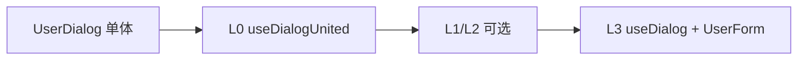

# ADR 0001：存量单体弹窗（UserDialog）渐进式接入

- **状态**：Accepted（公共 API 定稿；实现待做）
- **日期**：2026-06-29
- **关联**：[ADR 0002](./0002-open-use-override-container-component.md)（split 工厂下 `container.component` 覆盖；**不含 united**）

---

## 背景

vue-layerx 的目标态是 **container + content** 分离：

```text
UserDialog（逻辑组合体）= BaseDialog + UserForm
```

存量项目里常见 **`UserDialog.vue` 内嵌 `<el-dialog>`**，短期内难以拆文件；调用方往往只需 `open()` / `close()`，暂不需要向 **container slot** 投递模板等 split 能力。

**问题**：如何让单体 `UserDialog` 接入 vue-layerx，且拆分后调用方 `open({ props })` 尽量不变？

### 现有约束（split）

```text
h(container, { modelValue: visible, … }, { default: () => h(content, …) })
```

merge 优先级：`open > use > define > create`（[`DESIGN.md`](../../DESIGN.md)）。

---

## 决策

### 1. 双工厂

| 工厂 | 官方示例 | 用途 |
|------|----------|------|
| **`createLayerUnited`** | **`useDialogUnited`** | 存量单体（container 在 content 内部） |
| **`createLayer(BaseDialog)`** | **`useDialog`** | 目标态 split |

```ts
export const useDialogUnited = createLayerUnited({
  props: { width: '480px', destroyOnClose: true },
  model: 'modelValue',
  adapter: (fragment) => ({
    content: {
      ...fragment.content,
      props: stripProps(fragment.content.props, 'direction'),
    },
    model: fragment.model,
  }),
})

export const useDialog = createLayer(BaseDialog, {
  props: { width: '480px' },
  adapter: (fragment) => ({ /* 动 container */ ...fragment }),
})
```

```ts
const userDialog = useDialogUnited(UserDialog, { closeOn: ['success'] })
userDialog.open({ props: { mode: 'edit' } })

// L3
const userDialog = useDialog(UserForm, { closeOn: ['success'] })
userDialog.open({ props: { mode: 'edit' } })
```

### 2. 角色与迁移

- **`UserDialog` 始终作为 content 槽位**（拆分后留下 `UserForm`，不是 `BaseDialog`）。
- L3：**换工厂** + **换 Content**；**重写 adapter**（若原先有）；不在 united 实例上升舱换 `BaseDialog`。
- **`visible`** 绑定 content 的 `model`（默认 `modelValue`），由 `UserDialog` 内嵌 `el-dialog` 消费。

### 3. united 配置域（公共 API）

用户侧只接触 **content 域** 与 **工厂默认项**，不出现 `container` 块。

| 来源 | 公共 API 形态 | 语义 |
|------|---------------|------|
| **`createLayerUnited`** | 顶层 `props` / `model` / `adapter` | 工厂默认（原 split 的 create container 配置） |
| **`useDialogUnited` / `open` / `clone`** | 顶层 `props` / `closeOn` / `component` | content 配置 |

工厂 `props` 与 `open({ props })` 合并后，作为 **`UserDialog` 的最终 props**（含 width、title 等传给内嵌 `el-dialog` 的字段）。

### 4. adapter（content-only）

- **不与 split 共用** `LayerAdapter`；L3 换工厂时 adapter **一并调整**，工作量可接受。
- united 使用 **`LayerUnitedAdapter`**，入参 / 出参 **均无 `container`**：

```ts
type LayerUnitedFragment = {
  content: LayerConfigContent
  model?: string
}

type LayerUnitedAdapter = (fragment: LayerUnitedFragment) => LayerUnitedFragment
```

- adapter 在 **united 管线完成 tier 合并之后**、bind 之前执行。
- 典型用途：过滤 `content.props`、整理 `content.slots`；**不**换壳、**不**搬 container slot。

### 5. 实现：united pipeline（无公开哨兵）

实现上通过 **与 split 分离的 united pipeline** 完成合并与渲染，**不必**维护 `createLayer({ component: 哨兵 })` 或 merge 后再 **fold** 的双域 fragment。

- united 实例在 **`createLayerInstance` 注入 united pipeline**（工厂创建时确定，生命周期内不变）。
- tier 数据仍可写入现有 store bucket（`create` / `use` / `open` / `use:template` 等），但 **united pipeline 读取时**：
  - 将 **`create` 的 props / model** 与 **`use` / `open` 的 content** 合并为 **`LayerUnitedFragment`**；
  - **不** 构造含 container.component 的中间态；
  - **不** 渲染外层 container，只 `h(content)`。
- `define` / `define:template` tier 在 united 下 **不汇入**（`defineLayer` 与 container 侧 `LayerTemplate` 禁用）。

具体模块划分（`merge` / `bind` / `render` 实现文件）留待实现 PR，本文不展开。

---

## united 能力边界

### 支持

- `open` / `close` / `visible` / `closeOn` / portal / `bindHost`
- **`LayerTemplate :to="userDialog"`**（**content** slot / use:template.content）

```vue
<LayerTemplate :to="userDialog" name="form-end">
  <ElFormItem label="备注">…</ElFormItem>
</LayerTemplate>
```

### 禁止 / 无意义

| 项 | 行为 |
|----|------|
| **`defineLayer`** | no-op + dev warn |
| **`LayerTemplate :to="layer"`** / **`:to container`** | no-op + dev warn |
| **`use` / `open` 的 `container` 块** | ignore + dev warn |
| **预写 container 配置以便 L3 少改 use 侧** | 不支持；L3 必换工厂 |

### TypeScript（低优先级）

- `LayerConfigUnitedCreate`：顶层 `props` / `model` / `adapter`；无 `content`
- `LayerConfigUnitedInstance`：content 侧；无 `container`

---

## 运行时（united pipeline 概要）

```text
① mergeUnited   store tiers → LayerUnitedFragment（仅 content + model）
② adapt         LayerUnitedAdapter（可选）
③ refs          ref 合并进 content.props
④ bindUnited    visible → content[model]；closeOn → content emits
⑤ renderUnited  仅 h(content)
```

与 split 对照：

```text
split:   merge → LayerConfigFragment(container + content) → LayerAdapter → bind → h(container, content)
united:  mergeUnited → LayerUnitedFragment → LayerUnitedAdapter → bindUnited → h(content)
```

split 工厂 `open` 换 `container.component` 见 [ADR 0002](./0002-open-use-override-container-component.md)。

---

## 迁移路径

```text
L0  useDialogUnited(UserDialog)；UserDialog 支持 props.modelValue
L1  （可选）width / title 等迁到 createLayerUnited({ props })
L2  （可选）去内壳 / inLayer；仍可用 useDialogUnited 或提前换 useDialog
L3  useDialog(UserForm)；defineLayer；adapter 按 split 重写
```



**约定**：setup 内绑定一次 instance；拆分后只改绑定行与工厂/adapter，业务页 `userDialog.open(...)` 可不动。

---

## 曾考虑的方案

| 方案 | 结论 |
|------|------|
| 单体作 container | 否决 |
| `useDialog(UserDialog)` 无标注 | 否决——双层或模型断裂 |
| `mixed` / `shell` 布尔 | 否决 |
| **merge 后 fold + container 哨兵** | 否决——由 **united pipeline** 在合并阶段直接产出 content-only fragment，无需公开哨兵 |
| united 与 split **共用** `LayerAdapter` | 否决——**LayerUnitedAdapter** content-only |
| united 上 `open` 换真实 container | 否决——换 `useDialog` 工厂 |
| `inLayer` 双模 | L2 可选 |

---

## 后果

### 正面

- 公共 API 与 split 同形（`useX(Content)`、`open({ props })`）。
- united adapter / 内部 fragment **只有 content**，与「只 render UserDialog」一致。
- 实现不必暴露哨兵；pipeline 分离后 split / united 互不污染。

### 限制

- united 无 `defineLayer`、无 container 侧 `LayerTemplate`。
- L3 若用过 united adapter，需 **改写** 为 split 的 `LayerAdapter`（动 container）。
- `containerRef` 在 united 下为 `null`。

### 与 split 分工

| 能力 | united | split |
|------|--------|-------|
| `LayerUnitedAdapter` / `LayerAdapter` | content-only | container + content |
| `defineLayer` | 禁用 | 支持 |
| `LayerTemplate :to container` | 禁用 | 支持 |
| `LayerTemplate :to instance`（content slot） | 支持 | 支持 |

---

## 后续工作

1. 实现 `createLayerUnited`、`LayerUnitedAdapter`、united pipeline（merge / bind / render）。
2. `createLayerInstance` 注入 united pipeline。
3. playground：`useDialogUnited(UserDialog)`。
4. `defineLayer` / container 侧 `LayerTemplate` 在 united 下短路。
5. （低优先级）`LayerConfigUnited*` 类型；回写 DESIGN「存量接入」。

---

## 参考

- [DESIGN.md](../../DESIGN.md)
- [form-module 示例](../examples/form-module/)
- [`src/api/create-layer.ts`](../../src/api/create-layer.ts)
- [ADR 0002](./0002-open-use-override-container-component.md)
